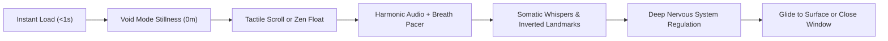
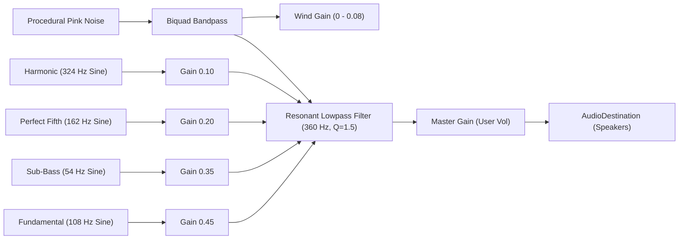

# Product Specification Document (PRD)
## Project: Bottomless — An Infinite Descent
**Document Version:** 1.0.0  
**Product Status:** Production / Live  
**Deployment URL:** [https://naveenchandaka47-cmyk.github.io/bottomless/](https://naveenchandaka47-cmyk.github.io/bottomless/)  
**Target Platforms:** Responsive Web (Desktop, Tablet, Mobile), Progressive Web App (PWA), Android Trusted Web Activity (TWA)

---

## 1. Executive Summary & Vision

### 1.1 Product Mission
**Bottomless** is a minimalist, production-grade stress-relief and mindfulness web application designed to counter sensory overload, screen fatigue, and chronic anxiety. Through a seamless, infinite vertical descent into a tranquil digital abyss, Bottomless replaces hyper-stimulating digital feeds with continuous calming motion, scientifically tuned 108Hz harmonic soundscapes, inverted architectural landmarks, somatic mindfulness whispers, and resonant heart-rate-variability (HRV) breathing pacing.

### 1.2 The "Five Zeroes" Manifesto
Most modern wellness and meditation applications have succumbed to the exact mechanisms that induce stress: aggressive paywalls, push notifications, artificial streaks, mandatory account creation, data harvesting, and gamification anxiety.

Bottomless is built upon an unyielding, radical design philosophy:
1. **Zero Ads:** No banners, interstitials, sponsored content, or commercial interruptions.
2. **Zero Permissions:** No camera, microphone, contacts, location, or biometric access requests.
3. **Zero Sign-In:** No user accounts, passwords, email capture, or social logins.
4. **Zero Trackers:** No third-party analytics, behavioral cookies, telemetry beacons, or external tracking scripts.
5. **Zero Fail States:** No timers, game overs, scores, streaks, or penalties. The descent is limitless and infinite.

```
┌─────────────────────────────────────────────────────────────────┐
│                       TRADITIONAL APPS                          │
│  Push Notifications ──► Sign In ──► Paywall ──► Guilt & Streaks │
├─────────────────────────────────────────────────────────────────┤
│                          BOTTOMLESS                             │
│       Instant URL ──► 0 Permissions ──► Infinite Calm Descent   │
└─────────────────────────────────────────────────────────────────┘
```

---

## 2. Target Audience & User Personas

### 2.1 User Personas

#### Persona A: The Overstimulated Knowledge Worker ("Alex", 32)
* **Context:** Software engineer or knowledge worker spending 9+ hours in front of screens, juggling Slack, email, and meetings.
* **Pain Points:** Eye fatigue, mental chatter, shallow chest breathing, subconscious jaw clenching.
* **App Usage:** Opens Bottomless during a 3-minute micro-break between meetings or while transitioning off work.
* **Primary Features Used:** Zen Float Mode, 5.5s Breath Pacer, Void (OLED Black) theme.

#### Persona B: The Restless Insomniac ("Maya", 27)
* **Context:** Struggling to fall asleep due to racing thoughts; scrolling endless social media feeds in bed in a dark room.
* **Pain Points:** Doom-scrolling bright feeds, blue light exposure, hyper-arousal.
* **App Usage:** Places phone on nightstand or holds it loosely in dark mode, listening to the 108Hz drone and slowly scrolling downward.
* **Primary Features Used:** 108Hz Harmonic Drone, Void Theme, Somatic Whispers.

#### Persona C: The Acute Anxiety / Panic Grounding Seeker ("David", 41)
* **Context:** Experiences sudden surges of acute panic, heart palpitations, and sensory overwhelm.
* **Pain Points:** Complex meditation apps requiring multi-step navigation, choices, or audio instructions increase panic.
* **App Usage:** Needs immediate, tactile grounding with zero cognitive load.
* **Primary Features Used:** Parachute scroll inertia, tactile depth milestones, instant mute/unmute.

### 2.2 User Journey


---

## 3. System Architecture & Tech Stack

Bottomless is built intentionally with zero heavyweight frontend frameworks (React, Vue, Angular) to ensure sub-100ms first paint, negligible battery drain, and guaranteed 60/120 FPS render performance on low-power mobile hardware.

```mermaid
graph TD
    subgraph UI Layer
        HUD["Top HUD (Depth, Zone, Velocity)"]
        World["Parallax World Container (Landmarks, Whispers)"]
        Canvas["Particle Field Canvas (Procedural Motes)"]
        Controls["Fixed Bottom Dock (Float, Breathe, Sound, Theme, Atlas)"]
        Popovers["Root Popover Layer (Sound, Theme, Backdrop)"]
    end

    subgraph Core Engines
        Physics["Physics Engine (Momentum, Terminal Velocity, Damping)"]
        Audio["Sound Engine (Web Audio API Synthesizer)"]
        Breath["Breath Pacer Engine (5.5s Resonant Cycle)"]
        Milestones["Milestone Manager (Atlas Discovery, Proximity)"]
    end

    subgraph Storage & PWA
        SW["Service Worker v2 (Network-First HTML, Offline Cache)"]
        LS["LocalStorage (Offline Discovered Landmarks Set)"]
    end

    Controls --> Physics
    Controls --> Audio
    Controls --> Breath
    Controls --> Milestones
    Physics --> HUD
    Physics --> World
    Physics --> Canvas
    Physics --> Audio
    Milestones --> LS
    SW --> UI Layer
```

### 3.1 Technology Stack
* **Language:** TypeScript 5.8+ (Strict Type Checking)
* **Bundler & Tooling:** Vite 8+ (Rollup Production Bundling, PostCSS)
* **Audio Synthesis:** Native Web Audio API (`AudioContext`, `OscillatorNode`, `BiquadFilterNode`, `GainNode`, `AudioBufferSourceNode`)
* **Graphics & Rendering:** HTML5 2D Canvas (Particle Simulation), Scalable Vector Graphics (Inverted Landmarks)
* **PWA & Offline:** Service Worker API v2, Web App Manifest (standalone display)
* **Version Control & CI/CD:** Git, GitHub Actions (`deploy.yml` with automated build & GitHub Pages deployment)

---

## 4. Functional Specifications & Feature Breakdown

### 4.1 Physics Engine & Momentum Descent
The descent experience is engineered to mimic parachute inertia and freefall through a viscous fluid, avoiding abrupt stops while preventing uncontrolled acceleration.

* **Damping Factor ($\mu$):** $0.92$ per frame. Momentum smoothly decays with a natural exponential curve.
* **Terminal Velocity ($v_{\max}$):** $24.0\text{ m/s}$. Calibrated to feel brisk yet readable and never dizzying.
* **Auto-Descend Speed (Zen Float):** $2.2\text{ m/s}$. Steady, hands-free calm glide.
* **Impulse Coefficients:**
  * Mouse Wheel: $\Delta y \times 0.018$ (normalized for wheel lines/pages).
  * Touch Drag: $\Delta y \times 0.06$ direct displacement + inertia fling up to $15.0\text{ m/s}$.
  * Keyboard Down / Space: $+1.8\text{ m/s}$.
  * Keyboard PageDown: $+5.5\text{ m/s}$.
  * Keyboard Up: $-1.8\text{ m/s}$ (gentle deceleration).
  * Keyboard PageUp: $-5.5\text{ m/s}$.
  * Home Key / Surface Button: Smooth physics glide back to $0\text{ m}$ ($v = -18\text{ m/s}$).

### 4.2 Harmonic Audio Synthesizer (Sound Engine)
The audio architecture does not rely on static MP3/WAV recordings. It is an algorithmic, multi-oscillator procedural synthesizer that generates infinite, non-looping audio directly in the browser.



#### Acoustic Specifications
* **Fundamental Frequency:** $108.0\text{ Hz}$ (A therapeutic low tone associated with stillness and traditional meditation bowls).
* **Harmonic Structure:**
  * Fundamental: $108\text{ Hz}$ (Sine)
  * Sub-Octave: $54\text{ Hz}$ (Sine, grounding deep warmth)
  * Perfect Fifth: $162\text{ Hz}$ (Sine, pure harmonic resonance)
  * Octave Overtone: $324\text{ Hz}$ (Sine, subtle atmospheric presence)
* **Velocity-Modulated Abyssal Wind:** Procedurally generated pink noise filtered through a $240\text{ Hz}$ bandpass filter. Gain dynamically scales with descent velocity ($0.0 \to 0.08$).
* **Depth Micro-Glide:** As depth increases, fundamental frequency undergoes an imperceptible micro-detune ($\pm 1.5\text{ Hz}$) over thousands of meters, simulating environmental density.
* **Audio Presets:**
  1. `harmonic108`: Pure 108Hz Pythagorean overtone drone.
  2. `singingBowl`: Slow $0.15\text{ Hz}$ amplitude modulation mimicking a struck bronze Tibetan singing bowl.
  3. `deepAbyss`: Heavy sub-bass emphasis ($54\text{ Hz}$) with high-cut filter ($220\text{ Hz}$) for subterranean immersion.
* **Mute by Default Policy:** To prevent sudden auditory shock upon loading in public or quiet spaces, the audio engine begins muted and can be toggled via the dock button or <kbd>M</kbd>.

### 4.3 Inverted Landmark Spatial System
To provide a profound sense of scale, world monuments, oceanic zones, and planetary boundaries are suspended upside down in the void, pointing toward the core of the Earth.

| Depth ($\text{m}$) | Milestone Name | Subtitle | Category | Visual Icon |
|:---|:---|:---|:---|:---|
| $0$ | **The Surface** | The Threshold of Stillness | Oceanic | Scuba Diver |
| $40$ | **Recreational Scuba Boundary** | The Limit of Casual Exploration | Oceanic | Scuba Diver |
| $93$ | **Statue of Liberty** | Inverted Monolith (Torch to Pedestal) | Monument | Inverted Statue |
| $330$ | **Eiffel Tower** | Latticework in the Deep | Monument | Inverted Tower |
| $332$ | **Deepest Scuba Dive** | Ahmed Gabr Record (2014) | Oceanic | Deep Diver |
| $500$ | **Blue Whale Diving Limit** | The Song of Leviathans | Oceanic | Whale |
| $828$ | **Burj Khalifa** | Humanity’s Highest Scriptorium | Monument | Inverted Skyscraper |
| $1,000$ | **The Midnight Zone** | Extinction of Sunlight | Oceanic | Trench / Abyss |
| $1,800$ | **Grand Canyon Depth** | Two Billion Years of Silence | Natural | Inverted Canyon |
| $3,810$ | **RMS Titanic** | Resting on the Abyssal Plain | Monument | Shipwreck Bow |
| $6,000$ | **The Hadal Realm** | Named for Hades, the Underworld | Oceanic | Trench Abyss |
| $8,849$ | **Mount Everest (Chomolungma)** | Roof of the World, Inverted | Natural | Inverted Peak |
| $10,928$ | **Challenger Deep** | Mariana Trench Abyss | Oceanic | Hadal Floor |
| $12,262$ | **Kola Superdeep Borehole** | Deepest Artificial Penetration | Subterranean | Earth Crust Fracture |
| $20,000$ | **Oceanic Lithosphere** | The Crystalline Foundation | Subterranean | Basalt Plate |
| $35,000$ | **Mohorovičić Discontinuity** | Boundary of Crust & Mantle | Subterranean | Mantle Boundary |
| $150,000$ | **Diamond Genesis Zone** | Purity Born Under Pure Pressure | Subterranean | Crystal Mantle |
| $400,000$ | **The Quiet Asthenosphere** | The Flowing Earth (Millimeters/Decade) | Subterranean | Ductile Mantle |
| $2,890,000$ | **Gutenberg Discontinuity** | The Liquid Iron Sea (Outer Core) | Subterranean | Molten Core Shore |
| $6,371,000$ | **Center of the Earth** | Point of Zero Gravity | Cosmic | Gravity Singularity |
| $10,000,000+$| **The Boundless Expanse** | Beyond All Boundaries | Cosmic | Infinite Horizon |

* **Proximity Haptics:** On devices supporting the Vibration API (`navigator.vibrate`), passing within 4 meters of a milestone triggers a single, subtle $20\text{ms}$ somatic haptic pulse.
* **Atlas Drawer:** Discovered landmarks are permanently saved to `localStorage` under `bottomless_discovered`. Users can open the Atlas drawer at any time to review discovered lore and jump directly to discovered depths.

### 4.4 Mindful Somatic Whispers
At calibrated intervals of $\approx 140\text{ meters}$ (offset by $70\text{m}$ to prevent collision with landmark cards), brief somatic reminders gently fade in and out:

> *"Unclench your jaw."*  
> *"Drop your shoulders away from your ears."*  
> *"Let your tongue rest gently behind your upper teeth."*  
> *"You do not need to produce anything right now."*  
> *"No expectations. No score to beat. No finish line."*  
> *"Notice the silence between your heartbeats."*  

Whispers auto-dismiss as the descent continues, leaving no residual clutter on screen.

### 4.5 Resonant Breath Pacer (5.5s Cycle)
Toggled via the **Breathe** button or <kbd>B</kbd>:
* **Scientific Protocol:** $5.5\text{ seconds inhale} + 5.5\text{ seconds exhale} = 11.0\text{s total cycle}$ ($5.5\text{ breaths per minute}$).
* **Physiological Goal:** Maximizes Heart Rate Variability (HRV), stimulates the vagus nerve, and synchronizes cardiovascular oscillations (Traube-Hering-Mayer waves).
* **Visual Presentation:** A pulsating dual-ring concentric pacer with an inner glowing core that expands smoothly during inhalation, pauses briefly at peak expansion, contracts during exhalation, and rests before the next cycle.

### 4.6 Visual Palettes & Themes
Three high-contrast, mindful color schemes:

| Theme ID | Name | Primary Tone | Background Color | Mote Palette | Intended Environment |
|:---|:---|:---|:---|:---|:---|
| `void` (Default) | **Void** | Pulsar Cold Blue | `#08090C` (OLED Matte Black) | Starlight Diamond Motifs | Bedtime, dark rooms, OLED battery saving |
| `mist` | **Mist** | Warm Earth Clay | `#FAF8F5` (Eggshell Bone) | Golden Sepia Motifs | Bright daytime, morning light |
| `tide` | **Tide** | Seaweed Jade | `#EBF3F0` (Coastal Seafoam) | Bioluminescent Teal Motifs | Afternoon screen fatigue, cool ocean wash |

* **Canvas Particle Field:** $300$ procedural ambient motes with depth-scaled z-indices ($0.2 \to 2.5$), subtle Brownian drift, and velocity-based vertical motion-blur stretching.

### 4.7 Adaptive HUD Telemetry
* **Dynamic Metric Scaling:** Depths $< 1,000\text{ m}$ render as integer meters (e.g., `450 m`). Depths $\ge 1,000\text{ m}$ automatically transition to two-decimal kilometer notation (e.g., `3.81 km`), preventing large unreadable digit strings while retaining precise meter count in subtext.
* **Unit System Toggle:** Tap unit button to toggle instantly between Metric ($\text{m} / \text{km}$) and Imperial ($\text{ft} / \text{mi}$).
* **Geological & Oceanic Zones:** Real-time zone badge continuously updates through Epipelagic, Mesopelagic, Bathypelagic, Abyssopelagic, Hadalpelagic, Lithosphere, Mantle, Core, and Infinite Expanse.
* **Immersive Soften Mode:** After 3.5 seconds of steady descent without cursor or touch activity, HUD and bottom dock smoothly fade to $30\%$ opacity (desktop) or retain high contrast (mobile) to maximize visual immersion. The moment descent slows or interaction occurs, full opacity returns instantly.

---

## 5. UI/UX & Responsive Engineering Specifications

### 5.1 Mobile Navigation Dock Architecture
Mobile viewports (Android Chrome, iOS Safari, PWA) present unique constraints: dynamic URL bars, bottom soft navigation bars, notches, and home swipe indicators.

```
┌───────────────────────────────────────────────┐
│ Top HUD:  bottomless    25 m    [Rules]       │
│                                               │
│                                               │
│             Landmark Illustration             │
│            (Scaled to max 95px)               │
│                                               │
│                                               │
│ [ Popover Backdrop: Dismiss on tap outside ]  │
│                                               │
│ ┌───────────────────────────────────────────┐ │
│ │  Top  | Float | Breathe | Sound | Theme   │ │ Fixed Dock
│ └───────────────────────────────────────────┘ │ (100dvh safe)
└───────────────────────────────────────────────┘
```

1. **Fixed Docking:** The navigation bar is set to `position: fixed` with `bottom: max(12px, env(safe-area-inset-bottom, 12px))` and `width: calc(100% - 16px); max-width: 440px`.
2. **Columnar Action Pills:** On mobile screens ($\le 768\text{px}$), buttons transition from horizontal rows to stacked column pills (18px icon on top, 9.5px label below), fitting 5 to 6 items across screens as narrow as 320px without horizontal scrollbars.
3. **Decoupled Popover Hierarchy:** Dropdown menus (`#sound-menu`, `#theme-menu`) are direct children of `#app` with `z-index: 1500`, bypassing any CSS `transform` containing block clipping or overflow clipping on parent elements.
4. **Touch Backdrop Layer:** Opening any popover engages `#popover-backdrop` (`z-index: 1400; position: fixed; inset: 0`). Tapping anywhere outside the popover dismisses it immediately.
5. **Dual Event Binding (`pointerup` + `click`):** All interactive buttons and popover options listen to debounced `pointerup` and `click` with `touch-action: manipulation`, eliminating 300ms mobile tap delays and missed touches.

---

## 6. Offline PWA & Service Worker Specifications

Bottomless is a Progressive Web App capable of operating 100% offline without active internet connectivity.

### 6.1 Service Worker v2 Lifecycle
* **Cache Name:** `bottomless-v2`
* **Navigation Requests (`mode: 'navigate'` / HTML):** **Network-First**. When online, the browser fetches the latest HTML from GitHub Pages to apply updates immediately. If offline, it falls back to the cached `index.html`.
* **Static Assets (Hashed JS, CSS, SVG, Icons):** **Stale-While-Revalidate / Cache-First**. Bundled static assets are served from cache instantly while being refreshed in the background.
* **Immediate Activation:** `self.skipWaiting()` and `self.clients.claim()` take effect immediately upon deployment without requiring users to close background tabs.
* **Proactive Update Check:** `main.ts` executes `registration.update()` upon page load.

### 6.2 Web App Manifest (`manifest.json`)
* **Display Mode:** `standalone`
* **Orientation:** `portrait-primary` / `any`
* **Background & Theme Color:** `#08090C` (Void OLED Black)
* **Icons:** High-resolution maskable PNG assets (`192x192` and `512x512`).
* **Android TWA Compatibility:** Packagable into an APK using Google Bubblewrap for native Play Store listing.

---

## 7. Non-Functional Requirements (NFRs)

### 7.1 Performance
* **First Contentful Paint (FCP):** $< 300\text{ ms}$ on 4G networks.
* **Time to Interactive (TTI):** $< 500\text{ ms}$.
* **Frame Rate:** Locked $60\text{ FPS}$ on standard displays; native $120\text{ FPS}$ on ProMotion / high-refresh-rate mobile displays.
* **Bundle Budget:** Total gzipped production bundle size $< 25\text{ kB}$ (CSS: $\approx 4.6\text{ kB}$, JS: $\approx 16.8\text{ kB}$).

### 7.2 Privacy & Security
* **Zero Cookies:** No session cookies, authentication tokens, or tracking cookies stored.
* **Zero External Network Calls:** No CDN scripts loaded at runtime; fonts and assets bundled or system-native.
* **Content Security Policy (CSP):** `default-src 'self'`.

### 7.3 Accessibility & Usability
* **Keyboard Navigation:** Full desktop keyboard shortcut coverage (<kbd>Space</kbd>, <kbd>↓</kbd>/<kbd>↑</kbd>, <kbd>PageDown</kbd>/<kbd>PageUp</kbd>, <kbd>M</kbd>, <kbd>F</kbd>, <kbd>B</kbd>, <kbd>T</kbd>, <kbd>Home</kbd>, <kbd>Esc</kbd>).
* **Color Contrast:** All text and interactive controls maintain WCAG 2.1 AA compliant contrast ratios ($\ge 4.5:1$).
* **Touch Target Size:** All touch targets maintain minimum dimensions of $44\text{px} \times 44\text{px}$.

---

## 8. Product Roadmap & Future Enhancements

### Phase 1: Core Experience (Completed & Deployed v1.0)
- [x] Zero-latency parachute inertia physics engine
- [x] Web Audio API 108Hz quad-oscillator drone synthesizer
- [x] 21 inverted real-world and geological milestones
- [x] 35 somatic mindful whispers
- [x] 5.5s resonant breath companion widget
- [x] Void, Mist, and Tide theme palettes
- [x] Responsive mobile dock with safe-area insets & popover backdrops
- [x] PWA offline support with Service Worker v2 & GitHub Pages CI/CD

### Phase 2: Auditory & Sensory Expansion (v1.1)
- [ ] **Binaural Beat Customizer:** Adjustable theta ($4\text{–}7\text{ Hz}$) and alpha ($8\text{–}12\text{ Hz}$) frequencies for deep sleep and focus states.
- [ ] **Spatial Gyroscope Audio:** Panning harmonic soundscape left/right as the mobile device is tilted.
- [ ] **Session Reflection:** An optional local summary upon returning to the surface (time spent in descent, lowest depth reached, breaths completed).

### Phase 3: App Store Distribution (v1.2)
- [ ] **Google Play Store TWA:** Deploying via Digital Asset Links as a native zero-permission Android application.
- [ ] **Apple App Store WebKit Container:** Packaging via Capacitor/WebKit for iOS distribution.
- [ ] **WearOS / Apple Watch Companion:** Standalone 108Hz haptic pacer for wrist-based breathing.

---

## 9. Conclusion
Bottomless represents a purposeful departure from the attention economy. By engineering software that asks nothing of the user—no identity, no money, no data, no performance—it provides a rare digital sanctuary where descent is peace, gravity is gentle, and stillness is boundless.
